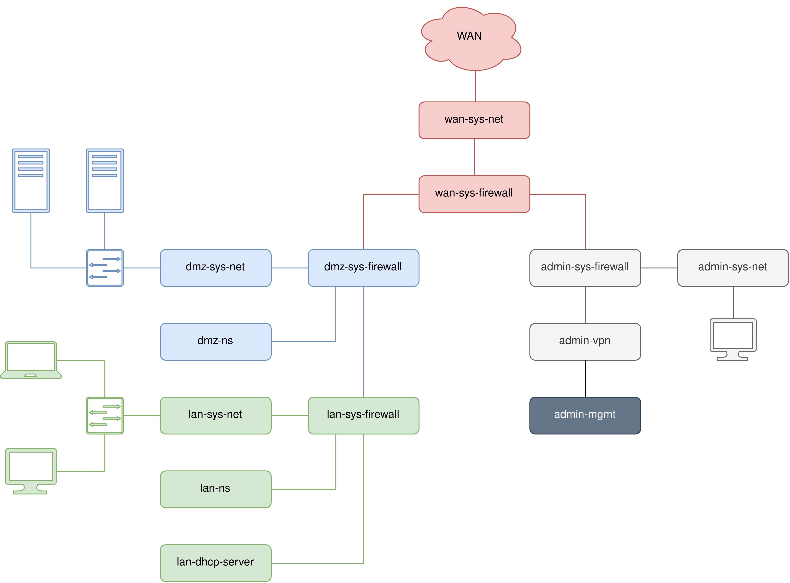

Qubes OS Server configuration
===========================================

Qubes OS Server is currently designed to work with `debian-10-minimal` template based `VM`. Installing Qubes OS Server consists in enabling and applying several formula.

> WARNING: Default `pillar` data are to be __adapted__ to host machine `PCI` devices, network topology and configuration, sensitive informations like `SSH` keys or `VPN` certificates, etc.

The `network` stage can be optional regarding the configuration. By default, a network backend `VM` called `sys-net-interfaces` is created. First, a `bond` device (LACP mode) is created with network interfaces specified in `pillar` data. This link is assumed to be a `trunk`. Second, several `vlan` interfaces are created respectively to `tags` specified in `pillar` data. Finally, `bridge` interfaces are created for each `vlan` tag interface.

A minimal working Qubes OS installation is required for installing packages dependencies in `dom0` and `TemplateVM`. `pillar` data have to be adapted in consequences and manual post-steps would might be needed. For example, in a standard Qubes OS installation, giving back the attached interface(s) of `sys-net` to `sys-net-interfaces`.

Any other architecture is possible. This `qubes-server` formula gives an example of a `generic` server architecture which can be adapted or recreated from scratch. The involved services into this architecture such as `dns`, `vpn` or `dhcp` server are created from `SaltSack Formula` adapted to Qubes context. The three used formulas are provided here:

- https://github.com/fepitre/qubes-saltstack-formulas-bind
- https://github.com/fepitre/qubes-saltstack-formulas-openvpn
- https://github.com/fepitre/qubes-saltstack-formulas-dhcpd

Pre Installation
===

Install QubesOS-contrib repositories package `qubes-repo-contrib` in `dom0` and `debian-10-minimal`.

Automatic installation
===

Under directory `/src/formulas/base/qubes-server`, script `qubes-server-install.sh` ease the manual steps described in the next section.

For a full installation:

        ./qubes-server-install.sh --init --network --wan --admin --dmz --lan

For a partial installation, for example, only `wan` and `admin` zones:

        ./qubes-server-install.sh --init --network --wan --admin

Manual installation
===

1. Enable `pillar` data:

        qubesctl top.enable qubes-server pillar=True
        qubesctl top.enable qubes-server.wan pillar=True
        qubesctl top.enable qubes-server.admin pillar=True
        qubesctl top.enable qubes-server.dmz pillar=True
        qubesctl top.enable qubes-server.lan pillar=True

2. Enable and apply `init` stage:

        qubesctl top.enable qubes-server
        qubesctl --target=debian-10-minimal state.highstate
        qubesctl top.disable qubes-server

3. Enable and apply `network` stage:

        qubesctl top.enable qubes-server.network
        qubesctl --target=sys-net-interfaces state.highstate
        qubesctl top.disable qubes-server.network

At this point, ensure `sys-net-interfaces` shows available bridges by issuing `qvm-device bridge` in dom0.

4. Enable and apply `wan` stage:

        qubesctl top.enable qubes-server.admin
        qubesctl --target=admin-sys-net,admin-sys-firewall,admin-sys-net,admin-vpn,admin-mgmt state.highstate
        qubesctl top.disable qubes-server.admin

5. Enable and apply `admin` stage:

        qubesctl top.enable qubes-server.admin
        qubesctl --target=admin-sys-net,admin-sys-firewall,admin-sys-net,admin-vpn,admin-mgmt state.highstate
        qubesctl top.disable qubes-server.admin

6. Enable and apply `dmz` stage:

        qubesctl top.enable qubes-server.dmz
        qubesctl --target=dmz-sys-firewall,dmz-sys-net,dmz-ns state.highstate
        qubesctl top.disable qubes-server.dmz

7. Enable and apply `lan` stage:

        qubesctl top.enable qubes-server.lan
        qubesctl --target=lan-sys-firewall,lan-sys-net,lan-ns,lan-dhcp-server state.highstate
        qubesctl top.disable qubes-server.lan

Post Installation
===

Under directory `/src/formulas/base/qubes-server`, script `qubes-server-manage.sh` ease to `start` and `shutdown` zones. Here are several examples:

- Shutdown all `lan` and `admin` VMs:`

        ./qubes-server-manage.sh --action shutdown --lan --admin

- Shutdown all VMs:

        ./qubes-server-manage.sh --action shutdown --all

- Start `admin`, which will also start `wan` as `admin-sys-firewall` has NetVM `wan-sys-firewall`:

        ./qubes-server-manage.sh --action start --wan

> Note: `all` includes `sys-net-interfaces`